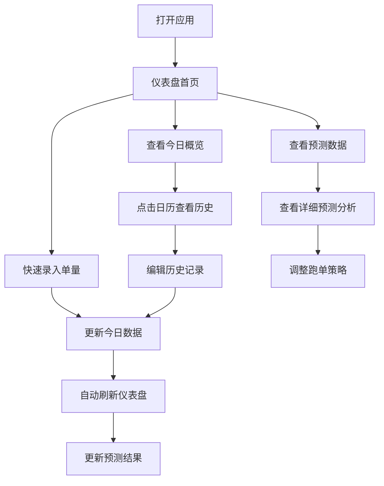

## 1. 产品概述

骑手工作台是一款专为美团骑手打造的智能订单管理与收入预测工具。帮助骑手记录每日单量、追踪月度进度、预测收入与明日单量，让跑单更有规划、更有动力。

- **目标用户**：美团外卖骑手（众包/专送）
- **核心价值**：数据驱动跑单决策，让每一单都算数

## 2. 核心功能

### 2.1 用户角色

| 角色 | 说明 |
|------|------|
| 骑手 | 使用本应用记录和管理个人跑单数据 |

### 2.2 功能模块

1. **仪表盘首页**：今日概览、关键指标卡片、快速录入入口
2. **每日记录**：历史单量日历视图、每日详情编辑
3. **收入中心**：收入明细、本月收入预测、累计收入统计
4. **智能预测**：明日单量预测、本月总单量预测、趋势图表
5. **目标管理**：设定月度目标、进度追踪、达成庆祝
6. **数据看板**：周/月趋势图表、对比分析、热力图
7. **成就系统**：里程碑徽章、连续打卡、排名激励

### 2.3 页面详情

| 页面名称 | 模块名称 | 功能描述 |
|----------|----------|----------|
| 仪表盘 | 今日概览卡片 | 今日单量、今日收入、本月累计、月目标进度，环形进度条 |
| 仪表盘 | 快速录入 | 一键增减今日单量，支持语音播报确认 |
| 仪表盘 | 明日预测卡片 | 基于历史数据智能预测明日单量，附置信度指示 |
| 仪表盘 | 收入预测卡片 | 本月预计总收入、日均收入、对比上月变化 |
| 每日记录 | 月历视图 | 日历热力图展示每日单量，颜色深浅表示单量高低 |
| 每日记录 | 日详情面板 | 点击日期查看/编辑当日单量、收入、工作时长、天气 |
| 每日记录 | 批量导入 | 支持快速录入多日数据 |
| 收入中心 | 收入明细列表 | 按日展示收入明细，支持筛选排序 |
| 收入中心 | 收入统计图 | 折线图展示本月每日收入趋势 |
| 收入中心 | 收入预测 | 基于当前进度+历史速率预测本月总收入 |
| 智能预测 | 明日预测 | AI预测明日单量，展示影响因素（天气、星期、近期趋势） |
| 智能预测 | 月度预测 | 预测本月总单量，实际vs预测对比图 |
| 智能预测 | 趋势分析 | 近30天单量趋势图，移动平均线 |
| 目标管理 | 目标设定 | 设置月度单量目标、日单量目标 |
| 目标管理 | 进度追踪 | 可视化进度条、剩余天数、每日需完成量 |
| 目标管理 | 达成庆祝 | 达成目标时触发庆祝动画效果 |
| 数据看板 | 周趋势图 | 本周每日单量柱状图 |
| 数据看板 | 月对比图 | 近6个月单量对比 |
| 数据看板 | 天气关联 | 天气与单量关系分析 |
| 成就系统 | 里程碑 | 累计100单/500单/1000单/5000单/10000单徽章 |
| 成就系统 | 连续打卡 | 连续记录天数奖励 |
| 成就系统 | 个人纪录 | 最高日单量、最高月收入等个人纪录 |

## 3. 核心流程

## 4. 用户界面设计

### 4.1 设计风格

- **整体风格**：Dark Mode 暗色主题，城市霓虹风格，融入美团品牌黄色作为主色调
- **主色调**：#FFD100（美团黄），#1A1A2E（深色背景），#16213E（卡片背景）
- **强调色**：#FF6B35（活力橙），#00D2FF（霓虹青），#7B2FF7（紫罗兰）
- **字体**：标题使用系统圆体，数字使用等宽字体突出数据感
- **布局**：移动优先设计，卡片式布局，底部导航栏
- **动效**：数字滚动动画、卡片悬浮效果、进度条流光、成就解锁粒子特效
- **图标**：使用 emoji 和 SVG 图标，简洁直观

### 4.2 页面设计概览

| 页面名称 | 模块名称 | UI 元素 |
|----------|----------|---------|
| 仪表盘 | 顶部问候栏 | 根据时间显示问候语，骑手头像，天气图标 |
| 仪表盘 | 关键指标卡片 | 4张卡片：今日单量、今日收入、本月累计、完成率，带环形进度 |
| 仪表盘 | 快速录入 | 大号 +/- 按钮，数字跳动动画，振动反馈提示 |
| 仪表盘 | 预测卡片 | 明日预测单量、预计收入，趋势箭头，置信度标签 |
| 仪表盘 | 底部导航 | 仪表盘/记录/预测/我的 四个Tab |
| 每日记录 | 月历热力图 | 方格日历，颜色深浅表示单量，点击弹出详情 |
| 每日记录 | 日详情弹窗 | 底部弹出面板，单量/收入/时长/天气编辑，保存按钮 |
| 收入中心 | 收入卡片 | 本月收入大字展示，对比上月百分比变化 |
| 收入中心 | 趋势图 | 折线图，渐变填充，数据点标注 |
| 智能预测 | 预测大卡 | 明日预测单量大字，影响因素标签列表 |
| 智能预测 | 趋势图 | 双线图：实际单量 vs 预测单量 |
| 目标管理 | 进度环 | 大号环形进度条，目标数值/已完成数值 |
| 目标管理 | 每日提示 | "还需每日完成 X 单即可达成目标" |
| 数据看板 | 柱状图 | 周对比柱状图，双色交替 |
| 成就系统 | 徽章墙 | 网格展示徽章，已解锁/未解锁状态，进度条 |

### 4.3 响应式设计

- 移动端优先，适配 375px-428px 宽度
- 桌面端居中展示，最大宽度 480px 模拟手机体验
- 触摸友好，按钮最小点击区域 44x44px
- 支持下拉刷新数据

## 5. 非功能需求

- **数据持久化**：使用 localStorage 本地存储，无需后端
- **离线可用**：PWA 支持，无网络也可使用
- **性能**：首屏加载 < 2s，交互动画 60fps
- **隐私**：所有数据存储在本地，不上传服务器