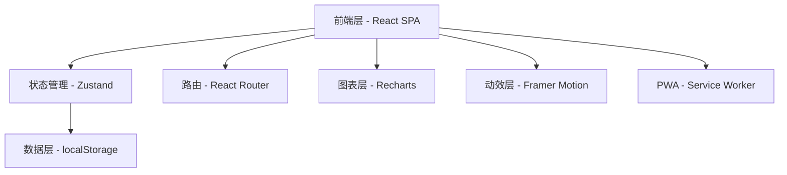
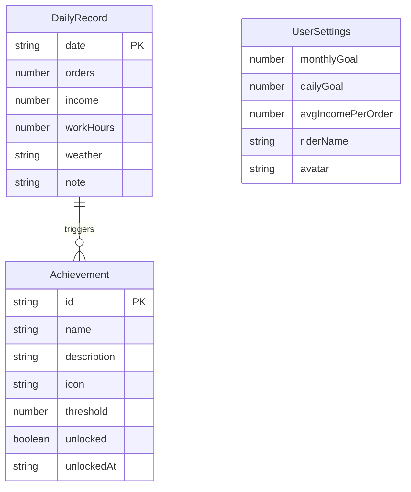

## 1. 架构设计



## 2. 技术选型

- **前端框架**：React@18 + TypeScript
- **构建工具**：Vite@5
- **样式方案**：Tailwind CSS@3 + CSS Variables
- **状态管理**：Zustand（轻量级，适合中等复杂度应用）
- **路由**：React Router v6
- **图表**：Recharts（React 原生图表库）
- **动效**：Framer Motion
- **数据持久化**：localStorage（封装为统一存储服务）
- **PWA**：vite-plugin-pwa
- **图标**：Lucide React
- **后端**：无（纯前端应用，数据本地存储）

## 3. 路由定义

| 路由 | 页面 | 说明 |
|------|------|------|
| `/` | 仪表盘 | 首页，今日概览、快速录入、预测卡片 |
| `/records` | 每日记录 | 月历视图、历史记录管理 |
| `/income` | 收入中心 | 收入明细、统计图表、收入预测 |
| `/predict` | 智能预测 | 明日预测、月度预测、趋势分析 |
| `/goals` | 目标管理 | 目标设定、进度追踪 |
| `/analytics` | 数据看板 | 周/月趋势、对比分析 |
| `/achievements` | 成就系统 | 徽章墙、里程碑展示 |

## 4. 数据模型

### 4.1 核心实体



### 4.2 数据结构定义

```typescript
// 每日记录
interface DailyRecord {
  date: string;           // YYYY-MM-DD
  orders: number;         // 当日单量
  income: number;         // 当日收入（元）
  workHours: number;      // 工作时长（小时）
  weather: 'sunny' | 'cloudy' | 'rainy' | 'snowy' | 'windy';
  note: string;           // 备注
}

// 用户设置
interface UserSettings {
  riderName: string;
  monthlyGoal: number;    // 月度目标单量
  dailyGoal: number;      // 日目标单量
  avgIncomePerOrder: number; // 平均每单收入
  workDaysPerWeek: number;   // 每周工作天数
}

// 成就
interface Achievement {
  id: string;
  name: string;
  description: string;
  icon: string;
  threshold: number;
  unlocked: boolean;
  unlockedAt: string | null;
}

// 存储 Schema
interface AppStorage {
  records: Record<string, DailyRecord>;
  settings: UserSettings;
  achievements: Achievement[];
}
```

## 5. 组件树

```
App
├── Layout
│   ├── Header (问候栏 + 天气)
│   ├── BottomNav (底部导航)
│   └── PageContent
├── Pages
│   ├── Dashboard
│   │   ├── GreetingHeader
│   │   ├── MetricCards (4张指标卡片)
│   │   ├── QuickEntry (快速录入)
│   │   └── PredictionCards (预测卡片)
│   ├── Records
│   │   ├── MonthCalendar (月历热力图)
│   │   ├── DayDetailSheet (日详情弹窗)
│   │   └── BatchImport (批量导入)
│   ├── Income
│   │   ├── IncomeSummary (收入汇总)
│   │   ├── IncomeTrendChart (趋势图)
│   │   └── IncomeList (明细列表)
│   ├── Predict
│   │   ├── TomorrowPrediction (明日预测)
│   │   ├── MonthlyPrediction (月度预测)
│   │   └── TrendChart (趋势分析)
│   ├── Goals
│   │   ├── GoalSetting (目标设定)
│   │   ├── ProgressRing (进度环)
│   │   └── DailyReminder (每日提示)
│   ├── Analytics
│   │   ├── WeekChart (周趋势)
│   │   ├── MonthCompare (月对比)
│   │   └── WeatherAnalysis (天气关联)
│   └── Achievements
│       ├── BadgeGrid (徽章墙)
│       └── PersonalRecords (个人纪录)
└── Shared
    ├── AnimatedNumber (数字动画)
    ├── ProgressRing (环形进度)
    ├── BottomSheet (底部弹窗)
    ├── Confetti (庆祝特效)
    └── Toast (提示消息)
```

## 6. 预测算法

### 6.1 明日单量预测

基于加权移动平均 + 星期因子 + 天气因子：

```
预测单量 = 近7日均值 × 0.5 + 近30日均值 × 0.3 + 上周同日 × 0.2
          × 星期因子(工作日1.1/周末1.0)
          × 天气因子(晴1.0/阴0.95/雨0.8/雪0.6)
```

### 6.2 本月总单量预测

```
预测总单量 = 已跑单量 + 日均单量 × 剩余工作天数
剩余工作天数 = 本月剩余天数 × (每周工作天数/7)
```

### 6.3 收入预测

```
预计收入 = 预测总单量 × 平均每单收入
```

## 7. 存储设计

使用 localStorage 存储，键名 `rider-workbench-data`，JSON 格式：

```json
{
  "version": 1,
  "records": {
    "2026-07-01": { "date": "2026-07-01", "orders": 35, "income": 245, "workHours": 8, "weather": "sunny", "note": "" }
  },
  "settings": {
    "riderName": "骑手",
    "monthlyGoal": 1000,
    "dailyGoal": 40,
    "avgIncomePerOrder": 7,
    "workDaysPerWeek": 6
  },
  "achievements": [...]
}
```

## 8. 项目初始化

```bash
npm create vite@latest rider-workbench -- --template react-ts
cd rider-workbench
npm install zustand react-router-dom recharts framer-motion lucide-react
npm install -D tailwindcss @tailwindcss/vite
```